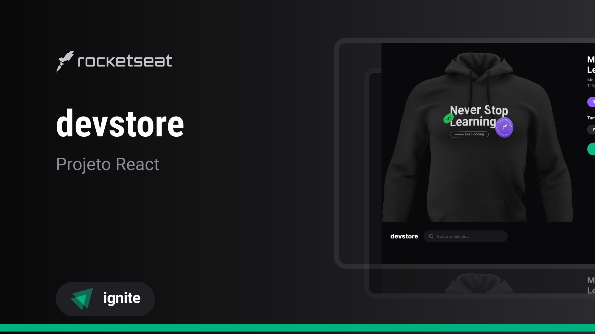

<h1 align="center"> DevStore </h1>

  <a href="#-tecnologias">Tecnologias</a>&nbsp;&nbsp;&nbsp;|&nbsp;&nbsp;&nbsp;
  <a href="#-projeto">Projeto</a>&nbsp;&nbsp;&nbsp;|&nbsp;&nbsp;&nbsp;
  <a href="#-layout">Layout</a>

 

  

## 🚀 Tecnologias

Esse projeto foi desenvolvido com as seguintes tecnologias:

- TypeScript
- React
- Next.JS
- TailwindCSS
- Git e Github
- Figma
- Cypress
- React Server Components
- Zod
- Lucide
- ESLint
- Prettier

## 💻 Projeto

DevStore é um projeto de e-commerce de produtos voltados para devs como camisetas, moletons, canecas.

- [Acesse o projeto finalizado, online](https://devstore-next-web.vercel.app/)

- [Assistir aulas](https://app.rocketseat.com.br/classroom/projeto-7)

## 🔖 Layout

Você pode visualizar o layout do projeto através [DESSE LINK](https://www.figma.com/community/file/1299037596397442545/devstore-projeto-react). É necessário ter conta no [Figma](https://figma.com) para acessá-lo.
